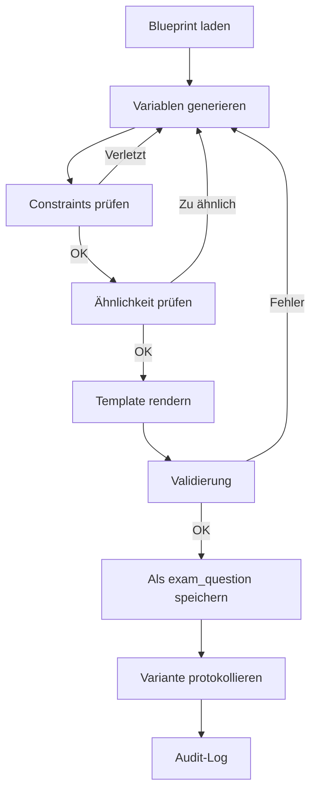

# Blueprint-Template-System

## Übersicht

Enterprise-Level System für prüfungssichere, variantenfähige, didaktisch saubere Fragen.

Ein **Blueprint** ist keine Frage, sondern:
- Ein abstraktes, prüfungsvalides Wissens- & Aufgabenmuster
- Aus dem beliebig viele hochwertige Varianten erzeugt werden können
- Ohne Bedeutungs-, Schwierigkeits- oder Kompetenzverlust

---

## Systemarchitektur

```
Blueprint
 ├─ Blueprint Core (Wissenslogik)          → question_blueprints
 ├─ Didactic Frame                         → Felder in question_blueprints
 ├─ Variable Slots                         → blueprint_variables
 ├─ Constraint Engine                      → blueprint_constraints
 ├─ Distractor Model                       → blueprint_distractors
 ├─ Correct Answer Model                   → blueprint_correct_answers
 ├─ Generated Variants                     → blueprint_variants
 └─ Audit & Versioning                     → blueprint_audit_log
```

---

## Datenmodell

### 1. Blueprint Core (`question_blueprints`)

| Feld | Typ | Beschreibung |
|------|-----|--------------|
| `curriculum_id` | UUID | SSOT-Verknüpfung (Pflicht) |
| `learning_field_id` | UUID | Lernfeld-Verknüpfung |
| `competency_id` | UUID | Kompetenz-Verknüpfung |
| `canonical_statement` | TEXT | Die fachliche Wahrheit (SSOT) |
| `knowledge_type` | ENUM | concept, procedure, calculation, regulation |
| `cognitive_level` | ENUM | remember (K1), understand (K2), apply (K3), analyze (K4) |
| `question_template` | TEXT | Template mit `{variable}` Platzhaltern |

### 2. Variable Slots (`blueprint_variables`)

```json
{
  "variable_name": "actor",
  "variable_type": "entity",
  "allowed_values": ["Arbeitgeber", "Auszubildender", "Kunde"]
}
```

| Typ | Beschreibung | Konfiguration |
|-----|--------------|---------------|
| `entity` | Feste Entitäten | `allowed_values` |
| `enum` | Aufzählungswerte | `allowed_values` |
| `number` | Zahlenbereiche | `range_min`, `range_max`, `range_step` |
| `text` | Muster-basierter Text | `text_pattern` |

### 3. Constraint Engine (`blueprint_constraints`)

```json
{
  "constraint_type": "conditional",
  "condition_expression": { "amount": "> 3000" },
  "action_expression": { "timeframe": "sofort" }
}
```

| Constraint-Typ | Beschreibung |
|----------------|--------------|
| `conditional` | Wenn A, dann muss B |
| `forbidden` | Diese Kombination ist verboten |
| `required` | Dieses Feld ist Pflicht |

### 4. Distraktor-Modell (`blueprint_distractors`)

Jeder Distraktor hat **didaktischen Sinn**:

| Error Type | Beschreibung |
|------------|--------------|
| `common_misconception` | Häufiger Irrtum |
| `overgeneralization` | Übergeneralisierung |
| `irrelevant_fact` | Irrelevante Tatsache |
| `partial_truth` | Teilwahrheit |
| `outdated_info` | Veraltete Information |
| `confusing_similar` | Verwechslung mit Ähnlichem |

### 5. Varianten (`blueprint_variants`)

```json
{
  "blueprint_id": "uuid",
  "exam_question_id": "uuid",
  "variable_values": { "actor": "Arbeitgeber", "amount": 2500 },
  "similarity_score": 0.42,
  "validation_passed": true
}
```

---

## Generation Protocol



### LLM-sichere Generierung

Das LLM darf **nur rendern**, nicht entscheiden:
- ✅ Variablen-Werte aus definierten Pools
- ✅ Constraints deterministisch geprüft
- ✅ Keine freie Text-Generierung für Fachinhalte
- ❌ Keine Erfindung von Antworten
- ❌ Keine Schwierigkeitsänderung

---

## API Nutzung

### Blueprint erstellen

```typescript
const { data } = await supabase
  .from('question_blueprints')
  .insert({
    curriculum_id: 'uuid',
    name: 'OSI-Schicht Zuordnung',
    canonical_statement: 'TCP gehört zur Transportschicht des OSI-Modells.',
    question_template: 'Zu welcher OSI-Schicht gehört {protocol}?',
    knowledge_type: 'concept',
    cognitive_level: 'understand',
    max_variations: 20
  });
```

### Variablen hinzufügen

```typescript
await supabase.from('blueprint_variables').insert([
  {
    blueprint_id: blueprintId,
    variable_name: 'protocol',
    variable_type: 'entity',
    allowed_values: ['TCP', 'HTTP', 'Ethernet', 'IP', 'UDP']
  }
]);
```

### Varianten generieren

```typescript
const { data } = await supabase.functions.invoke('generate-blueprint-questions', {
  body: { 
    blueprintId: 'uuid', 
    count: 10 
  }
});

// Response:
// { success: true, generated: 10, questionIds: [...] }
```

---

## Admin-UI

Route: `/admin-v2/blueprint-templates`

Features:
- Blueprint-Übersicht mit Status, Varianten-Count
- Neues Blueprint erstellen
- Variablen-Editor
- Distraktor-Editor mit Error-Type
- Constraint-Editor
- Varianten-Generierung mit Fortschrittsanzeige
- Audit-Log Viewer

---

## Qualitätssicherung

### Variation Rules

| Parameter | Standardwert | Beschreibung |
|-----------|--------------|--------------|
| `max_similarity_score` | 0.82 | Maximale Ähnlichkeit zu anderen Varianten |
| `min_variation_distance` | 0.18 | Minimale Distanz zwischen Varianten |

### Validation Layer

Jede Variante wird validiert:
- ✅ SSOT-Übereinstimmung
- ✅ Constraint-Prüfung
- ✅ Schwierigkeits-Konsistenz
- ✅ Sprachniveau-Check (B1/B2)

---

## Anti-Patterns (VERBOTEN)

| Anti-Pattern | Grund |
|--------------|-------|
| ❌ Fragen ohne Blueprint | Keine Rückverfolgbarkeit |
| ❌ Varianten ohne Constraints | Fachliche Fehler möglich |
| ❌ Copy-Paste-Fragen | Keine Skalierung |
| ❌ LLM entscheidet Inhalte | Halluzinationsgefahr |
| ❌ Schwierigkeit über Wortwahl | Nicht prüfungskonform |

---

## Änderungsprotokoll

| Datum | Änderung | Autor |
|-------|----------|-------|
| 2025-02-08 | Initiale Implementierung | System |
